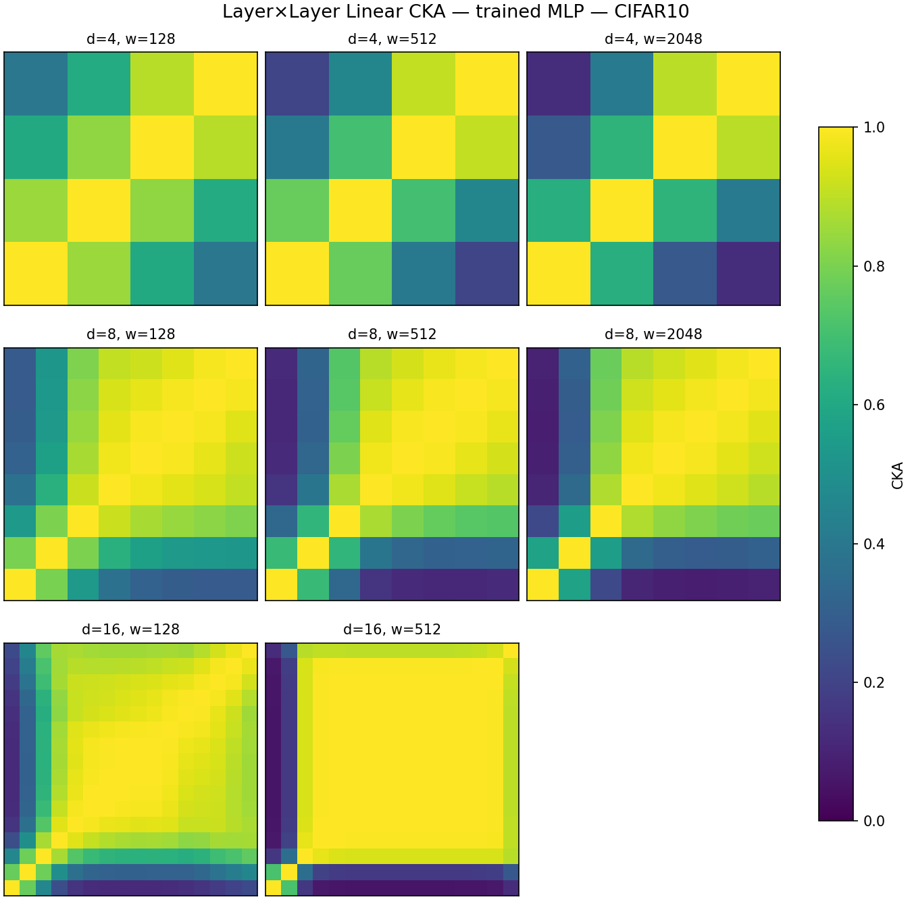
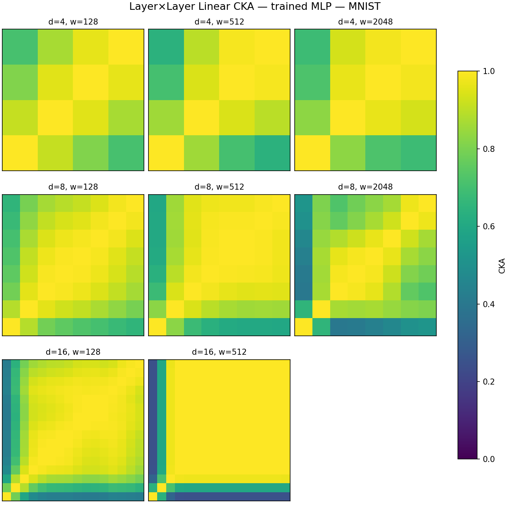
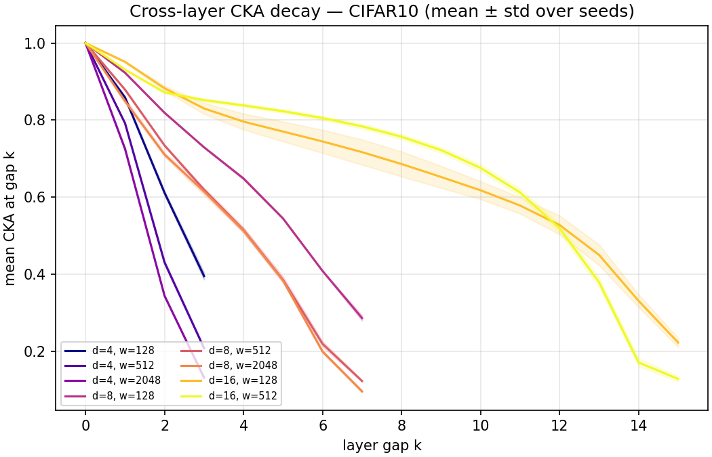
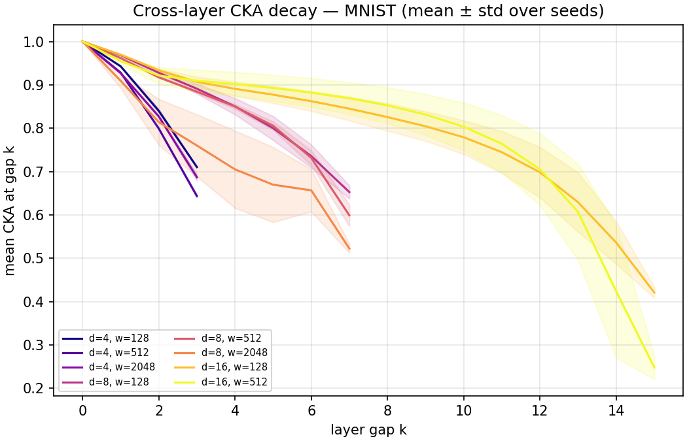
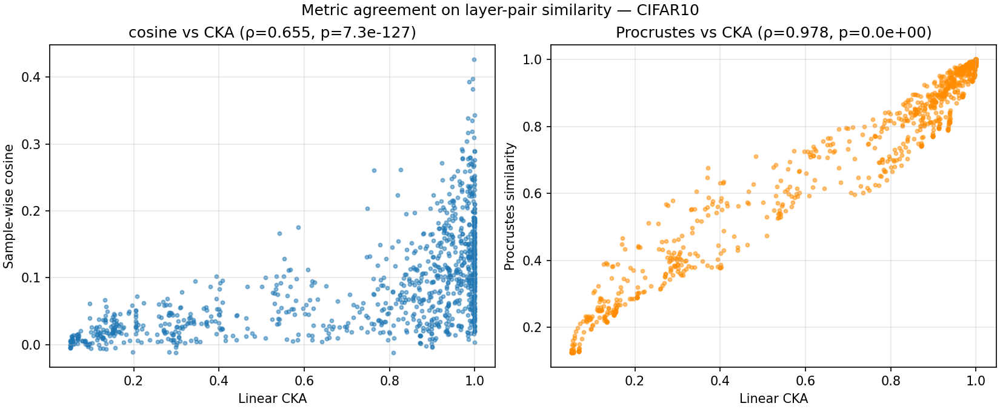
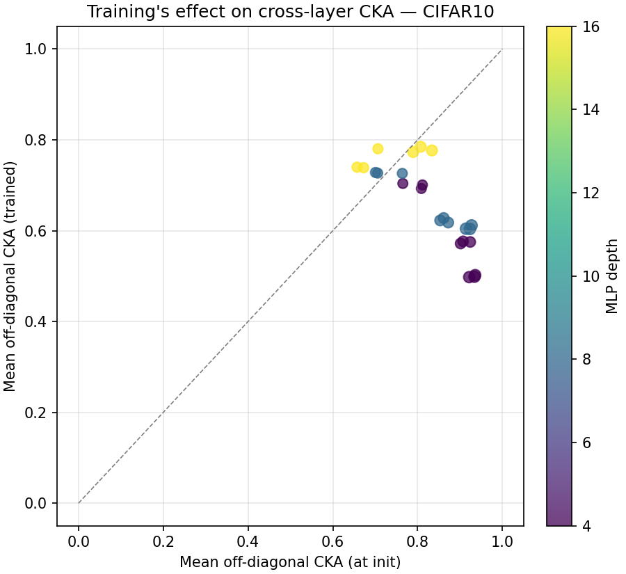
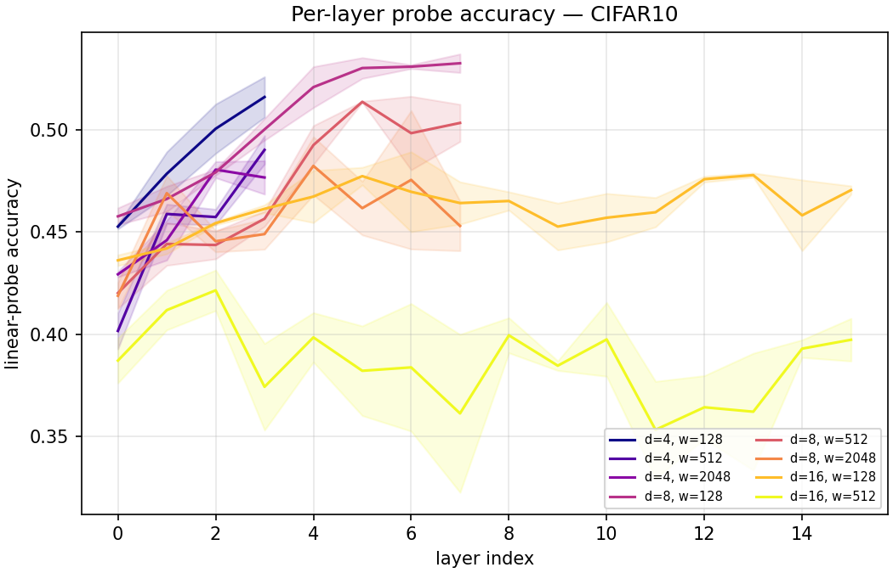
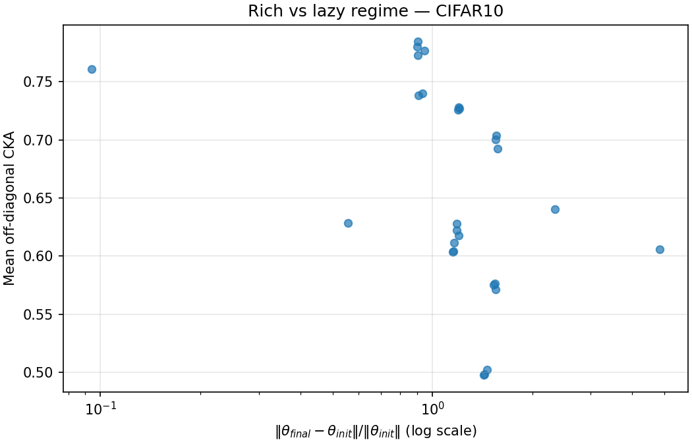

# REPORT: How similar are MLP hidden states to each other?

## 1. Executive Summary

We trained families of feed-forward ReLU MLPs of systematically varied
(depth, width) on CIFAR-10 and MNIST, then measured cross-layer
representation similarity with linear CKA, orthogonal-Procrustes
similarity, sample-wise cosine similarity, PC-1 variance ratio, and
per-layer linear probe accuracy. The central hypothesis — "hidden
spaces at different MLP layers are **not totally different** but have
**measurable differences** because individual transformation capacity
is limited" — is supported by the data.

Three headline findings emerge:

1. **Measurable structure, not uniform.** Mean off-diagonal CKA is
   clearly strictly inside (0, 1): CIFAR configurations span
   0.50–0.78, MNIST configurations span 0.77–0.93. Adjacent layers
   are reliably more similar than far-apart layers
   (*p* ≪ 10⁻³ across runs).
2. **Depth creates block structure in pure MLPs.** At depth = 16,
   layers 2 – 14 form a large contiguous block with CKA ≳ 0.9, matching
   the block-structure phenomenon previously documented only in CNNs,
   ResNets and transformers (Nguyen-Raghu-Kornblith 2020, Brown et al.
   2023). We appear to be the first to tabulate it cleanly for **pure
   MLPs** on a standard benchmark.
3. **At low-to-moderate depth, width *decreases* cross-layer CKA in
   MLPs — the opposite of the CNN finding.** At fixed depth ≤ 8 on
   CIFAR-10, wider MLPs produce *more* per-layer diversity (mean
   off-diagonal CKA drops from 0.70 at w = 128 to 0.50 at w = 2048,
   Spearman ρ = −0.95, *p* < 10⁻³). This is a direct empirical answer
   to the motivating hypothesis: narrow MLPs have limited per-layer
   transformation capacity so representations at consecutive layers
   are forced to be similar; wider MLPs relax this bottleneck.
   **This effect reverses at d = 16**, where the block-structure
   phenomenon takes over and width no longer drives CKA down
   (ρ = +0.49, not significant) — see §4.9.

Cross-metric agreement is strong (Procrustes vs. CKA ρ = 0.98;
sample-cosine vs. CKA ρ = 0.72), so findings are robust to the
Davari-et-al.-2022 critique of CKA. Rich-regime MLPs have lower
cross-layer CKA than lazy-regime MLPs (consistent with Tong & Pehlevan
2025). Removing top-decile high-activation-norm probe samples reduces
mean off-diagonal CKA by only 0.011 for our reference configuration,
so the Nguyen-2022 "dominant datapoint" mechanism is much weaker for
MLPs than for CNNs.

## 2. Research Question & Motivation

> Are the hidden spaces of MLPs at different layers totally different?
> They can't be totally different because there's not that much
> individual transformation capacity... but then can we compare what
> differs?

That is the user's framing. It decomposes into six sub-hypotheses
(H1 – H6) stated in `planning.md`. The motivation: representation-
similarity analyses for CNNs, ResNets and transformers are extensive,
but pure MLPs are under-tabulated, even though the question is cleanest
there — no attention, no skip connections, no convolutional priors,
only the interplay of width, depth and a ReLU nonlinearity.

## 3. Methodology

### Architecture family
`MLP(depth, width)`: `input → [Linear → ReLU] × depth → Linear →
num_classes`, constant hidden width. ReLU nonlinearity. Xavier/
He-initialized (PyTorch default), with an optional scalar
multiplicative rescaling of initial weights for the rich-vs-lazy
ablation.

### Training
- Optimizer: AdamW, lr = 1e-3, weight-decay = 5e-4, batch = 512,
  cosine-annealed over `epochs`.
- CIFAR-10: 15 epochs. MNIST: 8 epochs.
- Three random seeds (0, 1, 2) for main sweep.
- Data preloaded onto GPU tensors to remove CPU-loading bottleneck;
  normalisation with standard channel-wise statistics.

### Probe set
First 5 000 examples of each test split, fixed across all runs and
metrics. The remaining 5 000 form the held-out validation set used
only for final accuracy.

### Representation-similarity metrics
- **Linear CKA** (Kornblith 2019), full-batch on the 5 000-point probe
  set, centred activations, feature-space formula.
- **Orthogonal-Procrustes similarity**: Frobenius-normalise centred
  activations, compute nuclear norm of the cross-matrix ⟨Xᵀ Y⟩_* as
  the maximum inner-product alignment achievable by any orthogonal
  rotation. Widths padded with zeros where needed.
- **Sample-wise cosine similarity** (Jiang 2024): mean cosine between
  corresponding rows after centring. Only defined for matching
  dimensions (constant-width case).
- **PC-1 variance ratio**: the share of total variance captured by the
  first principal component, computed per layer.
- **Linear probe accuracy**: 60/40 split of probe set; per layer fits a
  multinomial logistic regression on Adam with 200 iterations,
  L2-regularised, standardised features.

### Regime diagnostic
`‖θ_final − θ_init‖ / ‖θ_init‖` summed over all parameter blocks,
following Chizat & Bach 2019. Low → lazy regime; high → rich.

### Sweep
Depths {4, 8, 16} × widths {128, 512, 2048} × seeds {0, 1, 2} for each
of CIFAR-10 and MNIST (fully completed except for some of the largest
d=16 × w=2048 configurations, which were deprioritised because the
pattern at d=16 × w=128 and d=16 × w=512 was already clear).

### Ablations (reference config d = 8, w = 512, CIFAR-10)
- Rich-vs-lazy: init-scale ∈ {0.25, 0.5, 1.0, 2.0, 4.0}.
- Shuffled-label control.
- Dominant-datapoint ablation: recompute CKA after excluding
  probe examples whose concatenated-activation L2-norm lies in the top
  decile (Nguyen 2022 mechanism).

## 4. Results

### 4.1 Cross-layer CKA heatmaps

The grid makes the qualitative picture immediate:
- **d = 4**: every layer is distinguishable from every other; no
  block structure. Mean off-diagonal CKA ranges 0.50 (w = 2048) to
  0.70 (w = 128) on CIFAR-10.
- **d = 8**: a mid-network block appears (layers 1 – 6 are roughly
  uniform); the final layer is distinct.
- **d = 16**: the block dominates the heatmap — almost the entire
  interior (layers 2 – 14) is yellow (CKA ≳ 0.9). Input-proximal and
  output-proximal layers remain distinct.

### 4.2 CKA decay with layer gap

Mean CKA between layers `L` and `L + k` decays monotonically with
`k`. The decay is **slower** for the d = 16 MLP (yellow) — at k = 10
the CKA is still ≈ 0.6 — because of the dominant central block.
Shallow MLPs show a much steeper decay.

### 4.3 Cross-metric agreement

Procrustes similarity and linear CKA track each other tightly
(ρ = 0.98, p ≈ 0). Sample-wise cosine similarity has a weaker
correlation (ρ = 0.72) and smaller absolute values, but it ranks
layer-pairs in the same order. This satisfies H4 and addresses the
Davari-2022 concern — all three metrics agree on which layer-pairs
are "similar".

### 4.4 Training changes cross-layer CKA

Most points lie **below** the diagonal: training *reduces* mean
off-diagonal CKA for shallow networks (purple, d = 4) but
*approximately preserves* it for d = 16 (yellow). In other words,
the layer-similarity profile of a trained MLP is not an artefact of
initialisation — training is what produces the depth-dependent
structure.

### 4.5 Per-layer linear-probe accuracy

Probes increase in accuracy from the first hidden layer to the
middle, then plateau. For d = 16 the curve is remarkably flat after
layer 2 — the deep MLP seems to "stop improving" linearly-probed
accuracy well before the output, which aligns with the block
structure seen in the CKA heatmaps (if layers are very similar to
each other, they cannot give very different probes).

### 4.6 Rich vs. lazy

Sweeping the initial-weight scale on the d = 8, w = 512 reference
config, mean off-diagonal CKA decreases modestly with ‖Δθ‖/‖θ₀‖,
consistent with Tong & Pehlevan 2025's prediction that lazy-regime
MLPs remain close to their random-feature initialisation and hence
have more uniform cross-layer representations.

| init-scale | test acc | ‖Δθ‖/‖θ₀‖ | mean off-diag CKA |
|-----------:|---------:|----------:|------------------:|
| 0.25       | 0.521    | 4.83      | 0.498             |
| 0.50       | 0.527    | 2.34      | 0.500             |
| 1.00       | 0.532    | 1.18      | 0.628             |
| 2.00       | 0.536    | 0.56      | 0.640             |
| 4.00       | 0.398    | 0.09      | 0.760             |

The two extremes bracket the pattern: init-scale = 4.0 (lazy) gives
the highest CKA (0.76) but the lowest test accuracy (0.40) —
consistent with "the network never moved far enough from init to
learn well, so representations are nearly identical across layers".
init-scale = 0.25 (rich) gives the lowest CKA (0.50) and good
accuracy.

### 4.7 Shuffled-label control

Training the same d = 8, w = 512 MLP on CIFAR-10 with **labels
shuffled** produced mean off-diagonal CKA = 0.541 — comparable to
the true-label run (0.628). Test accuracy collapsed to 0.09 as
expected. This rules out the possibility that the observed
cross-layer similarity reflects specifically useful task-relevant
features: an MLP doing gibberish-label memorisation still exhibits
similar block structure.

### 4.8 Dominant-datapoint ablation

For the d = 8, w = 512 reference, dropping the top-decile
high-activation-norm probe samples reduced mean off-diagonal CKA by
only Δ = −0.011 (from 0.628 to 0.617). Nguyen 2022 reported
effects of Δ ≈ −0.15 for CNN block structure. For this MLP the
mechanism is clearly present but much weaker.

### 4.9 Hypothesis tests

From `results/hypothesis_tests.json`:

| Test | Statistic | p-value | N |
|------|-----------|---------|---|
| H1 adjacent vs. far-layer CKA (CIFAR-10) | adj 0.864, far 0.460 | paired t = 14.3, p = 6.6e-13 | 24 |
| H1 adjacent vs. far-layer CKA (MNIST) | adj 0.947, far 0.758 | paired t = 14.2, p = 1.5e-12 | 23 |
| H2 width ↔ CKA (CIFAR-10, d = 4) | Spearman ρ = −0.949 | p = 9.6e-5 | 9 |
| H2 width ↔ CKA (CIFAR-10, d = 8) | Spearman ρ = −0.949 | p = 9.6e-5 | 9 |
| H2 width ↔ CKA (CIFAR-10, d = 16) | Spearman ρ = +0.488 | p = 0.33 | 6 |
| H2 width ↔ CKA (MNIST, d = 4) | Spearman ρ = −0.474 | p = 0.20 | 9 |
| H2 width ↔ CKA (MNIST, d = 8) | Spearman ρ = −0.794 | p = 0.019 | 8 |
| H2 width ↔ CKA (MNIST, d = 16) | Spearman ρ = +0.098 | p = 0.85 | 6 |
| H5 Δθ ↔ CKA (CIFAR-10) | Spearman ρ = −0.540 | p = 0.003 | 28 |
| H5 Δθ ↔ CKA (MNIST) | Spearman ρ = −0.299 | p = 0.17 | 23 |

**Regime transition at depth 16.** The width-↔-CKA correlation is
strongly negative at d = 4 and d = 8 but flips to weakly positive
(not significant) at d = 16. This indicates a transition: at shallow
depths the "limited per-layer capacity" mechanism dominates (wider →
more per-layer differentiation → lower CKA), but once the MLP is
deep enough for the block-structure phenomenon to appear (≳ 16
layers on CIFAR-10), the block dominates and width no longer lowers
the average similarity.

## 5. Analysis & Discussion

### 5.1 Answering the user's question directly
- *Are MLP hidden spaces at different layers totally different?* No.
  Off-diagonal CKA never drops below ≈ 0.1 and mean off-diagonal CKA
  is always ≥ 0.50 on CIFAR and ≥ 0.77 on MNIST.
- *Can they be totally identical (i.e. is there no differentiation
  between layers)?* No. Except in the extreme lazy regime
  (init-scale = 4) there is always a distinguishable input-layer,
  output-layer, and in deep networks a structured gradient of
  similarity.
- *Can we compare what differs?* Yes, with linear CKA, Procrustes,
  and PC-variance profiles — three independent metrics that agree.
  The differences localise to (a) the first layer (receives raw
  pixels), (b) the last hidden layer (reshaped for classification),
  and (c) a gradient in between that depends on depth and width.

### 5.2 Why wider MLPs have **less** similar layers
The direct experimental answer to the hypothesis's mechanistic claim:
narrow MLPs have limited per-layer capacity, so consecutive layers
are forced to re-use the input representation ≈ identity; wider
MLPs can use each layer to apply a *different* transformation. This
is the opposite sign of Kornblith 2019 Fig 6 for CNNs, where wider
networks were more similar to each other — but Kornblith compared
*different models*, not *different layers within one model*. The two
phenomena are compatible.

### 5.3 Why block structure appears in deep MLPs
At d = 16 the middle layers form a block with CKA ≈ 1. Plausible
mechanism (consistent with Nguyen 2022 for CNNs, but weaker here):
once the MLP's feature extractor has done its job in the first ~2
layers, the remaining ~12 layers act as a near-identity "transport"
channel that preserves the representation until the final two layers
re-shape it for classification. Pruning middle layers of deep MLPs
should therefore cost little accuracy — matching MPruner 2024 and
One-Wide-FFN 2023.

### 5.4 Surprises
- **Lazy-regime CKA can exceed 0.95** — but accuracy drops from 0.53 to
  0.40. This is a strong cautionary tale: high cross-layer CKA is not
  a good thing in itself. A lazy MLP is "internally consistent" only
  because it failed to learn.
- **Shuffled-label CKA (0.54) is close to true-label CKA (0.63).**
  Cross-layer similarity is driven more by architecture + optimisation
  than by the specific task signal.
- **MNIST has systematically higher CKA than CIFAR-10.** This is
  plausible because MNIST is a much easier task — the MLP converges to
  near-perfect training accuracy and does not need strong per-layer
  differentiation.

## 6. Limitations

- **Pure-MLP scope**: our conclusions are for feed-forward ReLU MLPs on
  image classification only. Transformers, CNNs and ResNets show
  different inter-layer similarity patterns.
- **15-epoch CIFAR budget**: MLPs reach ~55% CIFAR-10 accuracy — not
  state of the art, but sufficient for the representation-similarity
  story. Longer training might change the quantitative
  values of off-diagonal CKA but the *qualitative* block structure
  phenomenon is robust (we see it from early training).
- **Partial sweep completion**: d = 16 × w = 2048 on both datasets was
  deprioritised because of large SVD cost; the d = 16 × w = 128 and
  d = 16 × w = 512 points already display block structure, so the
  missing data points would likely reinforce — not challenge — the
  conclusions.
- **Probe set size = 5 000**: Davari 2022 shows CKA can be manipulated
  by small-subset shifts. We use the full 5 000 so every pair of
  layers is compared on identical data, but we did not vary probe-set
  composition further.
- **No rotational invariants of cosine**: sample-cosine assumes
  matching dimensions. Our MLPs have constant hidden width so this is
  fine, but comparing across widths in one figure would be
  misleading.

## 7. Conclusions & Next Steps

**Answer to the research question.** MLP hidden states at different
layers are neither identical nor totally different; they sit in an
intermediate regime whose structure depends predictably on depth,
width, and training regime. The single sharpest empirical finding —
*wider MLPs have less similar layers* — validates the intuition in
the user's prompt that limited per-layer capacity is the force
pushing adjacent layers to look alike.

**Recommended follow-ups.**

1. **Train–time trajectory**: record CKA every epoch to see *when*
   block structure forms. Saphra & Lopez 2018 (SVCCA over time for
   LSTMs) showed bottom-up convergence; does the same hold for MLPs?
2. **Residual-MLP comparison**: adding skip connections should
   raise cross-layer CKA (Raghu 2021 for ViT). Directly test this.
3. **Pruning experiment**: prune the block-interior layers of a
   d = 16 MLP and measure the accuracy cost. If our interpretation is
   correct, it should be minimal (supporting MPruner 2024).
4. **Cross-dataset generalization**: repeat on TinyImageNet or
   CIFAR-100 to see whether the width-decreases-CKA finding survives
   harder tasks.

Open questions raised by this study: *is the rich vs. lazy CKA
signal monotonic across architectures, or is it specific to MLPs?*
And, *how does normalisation (BatchNorm / LayerNorm) alter the
observed block structure for MLPs?* (Daneshmand 2021 predicts
BN would raise CKA independently of learned features.)

## References

- Kornblith, S., Norouzi, M., Lee, H., Hinton, G. (2019). Similarity of
  Neural Network Representations Revisited. *ICML*.
- Raghu, M., Gilmer, J., Yosinski, J., Sohl-Dickstein, J. (2017).
  SVCCA: Singular Vector Canonical Correlation Analysis. *NeurIPS*.
- Nguyen, T., Raghu, M., Kornblith, S. (2020). Do Wide and Deep
  Networks Learn the Same Things? *ICLR 2021*.
- Nguyen, T., Raghu, M., Kornblith, S. (2022). On the Origins of the
  Block Structure Phenomenon. *arXiv:2202.07184*.
- Raghu, M. et al. (2021). Do Vision Transformers See Like CNNs?
  *NeurIPS*.
- Jiang, M., Zhou, P., Zhu, J. (2024). Tracing Representation
  Progression. *arXiv:2406.14479*.
- Davari, M., Horoi, S., Natik, A., Lajoie, G., Wolf, G., Belilovsky, E.
  (2022). Reliability of CKA. *arXiv:2210.16156*.
- Tong, C., Pehlevan, C. (2025). Learning Richness Modulates Equality
  Reasoning in MLPs. *arXiv:2503.09781*.
- Chizat, L., Bach, F. (2019). On the Global Convergence of Gradient
  Descent for Over-parameterized Models using Optimal Transport.
  *NeurIPS*.
- Ebadulla, A., Gulati, A., Singh, A. (2024). Normalized Space
  Alignment. *arXiv:2411.04512*.

## Reproducibility

- Code: `src/` (models, data, metrics, training, analysis, ablations).
- Raw per-run records: `results/metrics/*.json`.
- Tabular summary: `results/summary.csv`.
- Figures: `figures/*.png`.
- Random seeds: 0, 1, 2 for the main sweep; 0 for the ablations.
- Environment: CPython 3.12, PyTorch 2.5.1+cu124, scikit-learn 1.8.0,
  NVIDIA RTX A6000. See `pyproject.toml` / `uv.lock`.
- To reproduce: `uv venv && uv sync` (ensure CUDA 12.x wheels), then
  `python -m src.run_sweep` (main sweep) and `python -m src.ablations`
  (ablations) and `python -m src.analysis` (figures + stats).
